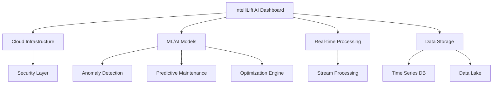
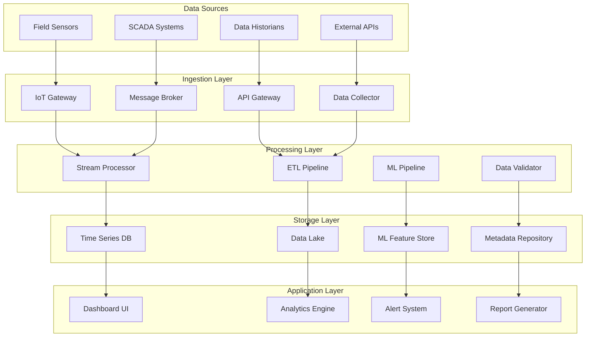
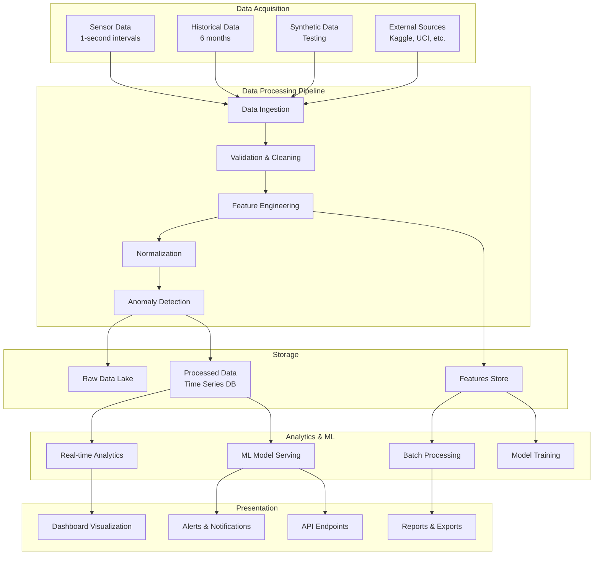
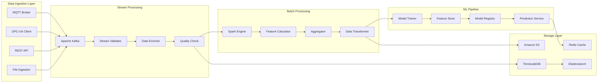
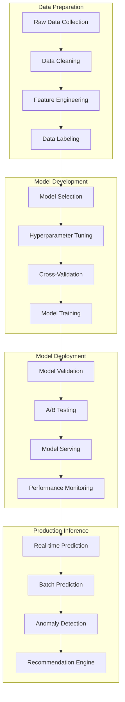
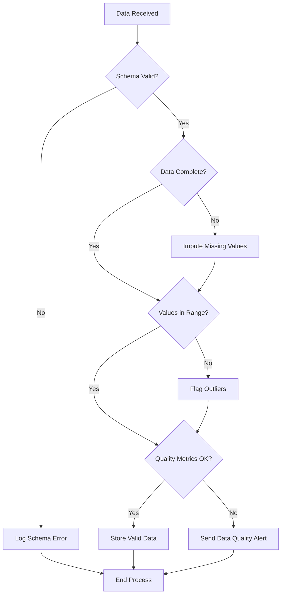
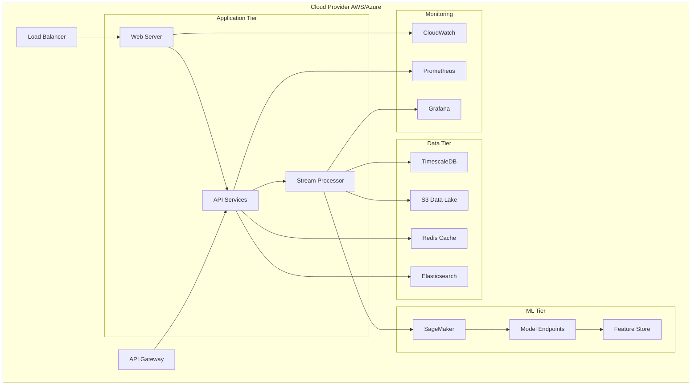

# **Software Requirements Specification (SRS)**
## **AI-Powered Artificial Lift Management Dashboard**

**Document Version:** 2.0
**Date:** December 29, 2024
**Author:** AI Systems Architect
**Status:** Final

---

## **Table of Contents**
1. Introduction
2. Overall Description
3. System Architecture
4. Specific Requirements
5. Data Processing Diagrams
6. External Interfaces
7. Appendices

---

## **1. Introduction**

### **1.1 Purpose**
This document specifies requirements for an AI-powered Artificial Lift Management Dashboard that enables real-time monitoring, predictive analytics, and data-driven decision making for oil and gas artificial lift operations.

### **1.2 Scope**
The "IntelliLift AI Dashboard" is a comprehensive cloud-based solution that provides:
- Real-time sensor data ingestion and processing
- Historical and synthetic data management
- Machine learning and AI analytics
- Multi-source data integration
- Advanced visualization and reporting

### **1.3 Definitions**
- **ALS:** Artificial Lift System
- **ESP:** Electrical Submersible Pump
- **KPI:** Key Performance Indicator
- **ETL:** Extract, Transform, Load
- **MLOps:** Machine Learning Operations

## **2. Overall Description**

### **2.1 Product Perspective**


### **2.2 User Roles**
| Role | Responsibilities | Access Level |
|------|-----------------|--------------|
| Field Operator | Real-time monitoring, alerts | Basic |
| Production Engineer | Analytics, optimization | Advanced |
| Data Scientist | Model development, analysis | Developer |
| Operations Manager | Reporting, KPIs | Management |

## **3. System Architecture**

### **3.1 High-Level System Architecture**


### **3.2 Data Flow Diagram**


## **4. Specific Requirements**

### **4.1 Functional Requirements**

#### **FR1: Data Ingestion**
- **FR1.1:** Support MQTT, OPC-UA, REST APIs for real-time data
- **FR1.2:** Handle 1-second interval data from 500+ sensors
- **FR1.3:** Ingest 6 months of historical data
- **FR1.4:** Support batch data uploads

#### **FR2: Data Processing**
- **FR2.1:** Real-time data validation and cleaning
- **FR2.2:** Automated feature engineering
- **FR2.3:** Data normalization and transformation
- **FR2.4:** Outlier detection and handling

#### **FR3: Analytics & ML**
- **FR3.1:** Real-time anomaly detection
- **FR3.2:** Predictive maintenance models
- **FR3.3:** Equipment failure prediction
- **FR3.4:** Production optimization recommendations

#### **FR4: Visualization**
- **FR4.1:** Real-time dashboard with <3s latency
- **FR4.2:** Historical trend analysis
- **FR4.3:** Geographic well mapping
- **FR4.4:** Customizable KPI widgets

### **4.2 Non-Functional Requirements**

#### **Performance**
- Data ingestion latency: <2 seconds
- Dashboard refresh: <3 seconds
- Query response: <5 seconds
- System availability: 99.9%

#### **Scalability**
- Support 10,000+ sensors
- Handle 1TB+ daily data
- Concurrent users: 500+

#### **Security**
- TLS 1.3 encryption
- Role-based access control
- Audit logging
- GDPR compliance

## **5. Data Processing Diagrams**

### **5.1 Data Processing Pipeline Architecture**


### **5.2 Machine Learning Pipeline**


### **5.3 Data Validation Flowchart**


## **6. Implementation Scripts**

### **6.1 Enhanced Synthetic Data Generator**
```python
import pandas as pd
import numpy as np
from datetime import datetime, timedelta
import json

class SyntheticALSDataGenerator:
    def __init__(self):
        self.sensor_specs = {
            'motor_temperature': {'min': 65, 'max': 120, 'unit': 'C'},
            'intake_pressure': {'min': 450, 'max': 600, 'unit': 'psi'},
            'discharge_pressure': {'min': 800, 'max': 1200, 'unit': 'psi'},
            'vibration': {'min': 0.5, 'max': 5.0, 'unit': 'g'},
            'current': {'min': 30, 'max': 80, 'unit': 'A'},
            'flow_rate': {'min': 1500, 'max': 2500, 'unit': 'bpd'}
        }
    
    def generate_well_data(self, well_id, start_date, days=180):
        """Generate 6 months of synthetic sensor data for a well"""
        total_seconds = days * 24 * 60 * 60
        timestamps = pd.date_range(start=start_date, periods=total_seconds, freq='1S')
        
        data = {
            'timestamp': timestamps,
            'well_id': well_id,
            'motor_temperature': self._generate_temperature_data(total_seconds, well_id),
            'intake_pressure': self._generate_pressure_data(total_seconds, 'intake'),
            'discharge_pressure': self._generate_pressure_data(total_seconds, 'discharge'),
            'vibration': self._generate_vibration_data(total_seconds, well_id),
            'current': self._generate_current_data(total_seconds),
            'flow_rate': self._generate_flow_data(total_seconds, well_id),
            'equipment_status': self._generate_status_data(total_seconds, well_id)
        }
        
        return pd.DataFrame(data)
    
    def _generate_temperature_data(self, n_samples, well_id):
        base_temp = 75 + np.random.normal(0, 2, n_samples)
        # Simulate gradual failure for specific wells
        if well_id in ['Well_08', 'Well_15']:
            failure_start = n_samples - (30 * 24 * 60 * 60)  # Last 30 days
            ramp = np.linspace(0, 1, n_samples - failure_start)
            failure_signal = np.concatenate([np.zeros(failure_start), ramp])
            base_temp += failure_signal * 25
        return np.clip(base_temp, 65, 120)

# Usage example
if __name__ == "__main__":
    generator = SyntheticALSDataGenerator()
    start_date = datetime.now() - timedelta(days=180)
    
    all_data = []
    for i in range(1, 11):
        well_data = generator.generate_well_data(f"Well_{i:02d}", start_date)
        all_data.append(well_data)
    
    final_df = pd.concat(all_data, ignore_index=True)
    final_df.to_parquet('synthetic_als_data_6months.parquet', index=False)
```

### **6.2 Advanced Data Downloader**
```python
import os
import requests
import pandas as pd
from kaggle.api.kaggle_api_extended import KaggleApi
import boto3
from botocore import UNSIGNED
from botocore.config import Config

class AdvancedDataDownloader:
    def __init__(self, config_path='./config'):
        self.config_path = config_path
        os.makedirs(config_path, exist_ok=True)
        self.setup_logging()
    
    def download_from_multiple_sources(self, search_terms):
        """Download data from all configured sources"""
        results = {}
        
        for term in search_terms:
            print(f"Searching for: {term}")
            
            # Kaggle
            results['kaggle'] = self.download_kaggle_datasets(term)
            
            # UCI Repository
            results['uci'] = self.download_uci_datasets(term)
            
            # AWS Open Data
            results['aws'] = self.download_aws_datasets(term)
            
            # data.gov
            results['data_gov'] = self.download_datagov_datasets(term)
        
        return results
    
    def download_kaggle_datasets(self, search_term):
        """Download from Kaggle with advanced search"""
        try:
            api = KaggleApi()
            api.authenticate()
            
            datasets = api.dataset_list(search=search_term, file_type='csv')
            downloaded_files = []
            
            for dataset in datasets[:3]:  # Limit to top 3 results
                print(f"Downloading {dataset.ref}")
                api.dataset_download_files(
                    dataset.ref, 
                    path=f"{self.config_path}/kaggle", 
                    unzip=True
                )
                downloaded_files.append(dataset.ref)
            
            return downloaded_files
        except Exception as e:
            print(f"Kaggle error: {e}")
            return []

# Additional implementation for other data sources...
```

## **7. Database Schema Design**

### **7.1 Time Series Data Schema**
```sql
-- Sensor readings table
CREATE TABLE sensor_readings (
    reading_id UUID PRIMARY KEY,
    well_id VARCHAR(50) NOT NULL,
    sensor_type VARCHAR(50) NOT NULL,
    sensor_value DOUBLE PRECISION NOT NULL,
    measurement_unit VARCHAR(20),
    data_quality INTEGER,
    timestamp TIMESTAMPTZ NOT NULL,
    created_at TIMESTAMPTZ DEFAULT NOW()
);

-- Well metadata table
CREATE TABLE well_metadata (
    well_id VARCHAR(50) PRIMARY KEY,
    well_name VARCHAR(100),
    location GEOGRAPHY(POINT),
    equipment_type VARCHAR(50),
    installation_date DATE,
    status VARCHAR(20),
    last_maintenance DATE
);

-- ML predictions table
CREATE TABLE ml_predictions (
    prediction_id UUID PRIMARY KEY,
    well_id VARCHAR(50) NOT NULL,
    model_type VARCHAR(50) NOT NULL,
    prediction_value DOUBLE PRECISION,
    confidence_score DOUBLE PRECISION,
    prediction_type VARCHAR(50),
    timestamp TIMESTAMPTZ NOT NULL
);

-- Create hypertable for time-series data
SELECT create_hypertable('sensor_readings', 'timestamp');
```

## **8. Deployment Architecture**

### **8.1 Cloud Deployment Diagram**


This comprehensive SRS document provides complete specifications for developing the AI-powered Artificial Lift Management Dashboard with all necessary diagrams and technical details.
